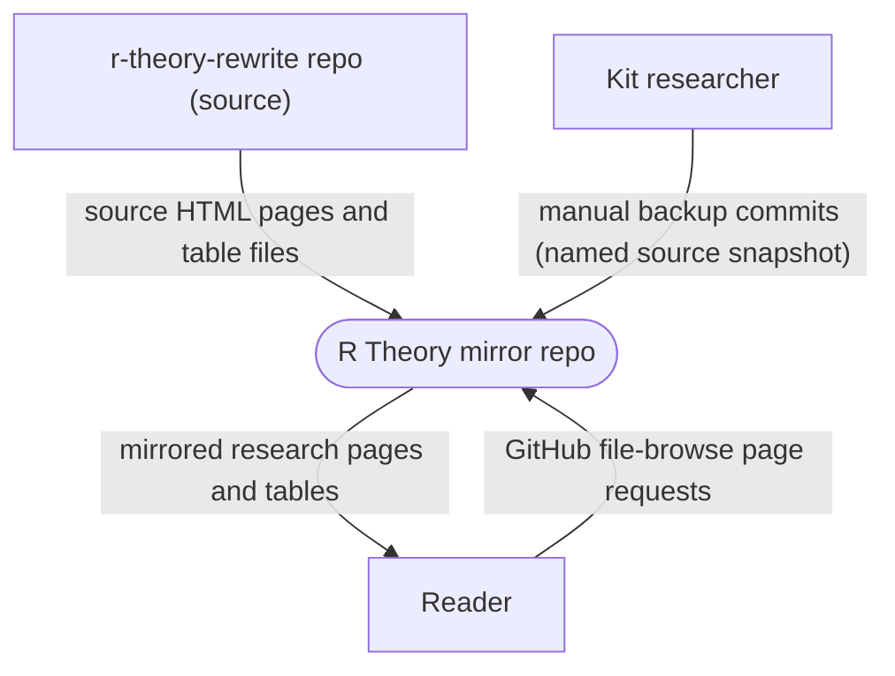
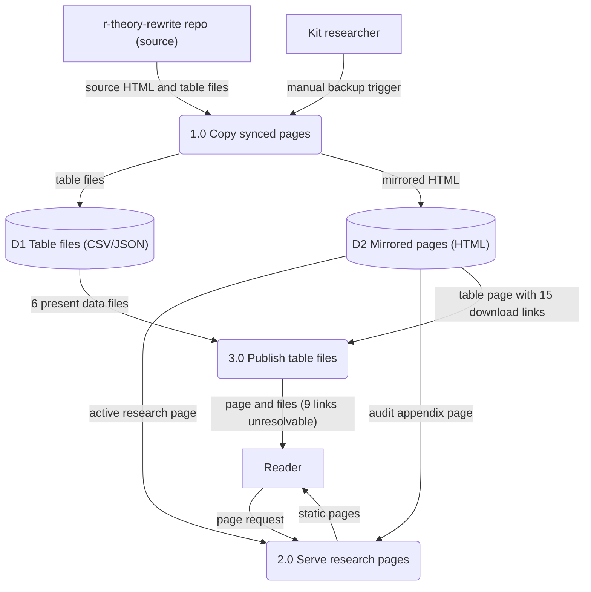
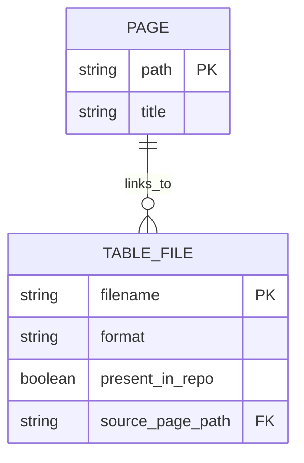

Living document — update these diagrams when adding features.
# r-theory — Architecture

Relationship to r-theory-rewrite: r-theory-rewrite is the SOURCE repo — the full rewrite series with all books, audit scripts, and build tooling. R-Theory is a derived BACKUP MIRROR containing only three page groups copied from r-theory-rewrite: tables, research, and appendix. The repo's own GitHub description says: backup mirror of the R Theory rewrite site research pages, synced from r-theory-rewrite. It has no README (the readme API call 404s) and no build tooling — it exists to preserve a readable copy of the research pages independent of the main series repo.

Observed contents (recursive tree listing, 15 paths total): LICENSE, docs/architecture.md, appendix/index.html, research/index.html, tables/index.html, plus six tables data files (Me_reference_diag.csv, Me_reference_params.json, P54_135_diag.csv, Pi0_grade_diag.csv, Pi2_grade_diag.csv, Pi_rest_grade_diag.csv). Page titles observed from the HTML: "R Theory — Active Research", "Computational Audit Appendix — R Theory Rewrite Series", "Pre-computed Tables — R Theory Rewrite Series".

## 1. Context diagram (level 0)

## 2. Level-1 data flow diagram

Process grounding: 1.0 is grounded on the mirror's own commit be47ccb4 (2026-09-25): "Backup 2026-09-25: updated webpages (tables/research/appendix) from r-theory-rewrite@c0faab2" — the backup is a manual copy by Kit, not a script, webhook, or cron (none observed in the 15-path tree). 2.0 and 3.0 reflect the static HTML pages and CSV/JSON data files actually present in the tree; the 9-unresolvable-links count is observed by comparing the 15 relative data-file hrefs in the mirror's tables/index.html against the 6 data files in its tables/ directory.

## 3. Entity–relationship diagram

No persistent data model observed — this is a static mirror with no code, no database, no forms. Minimal honest ERD of what the repo holds:

Observed: three pages (appendix/index.html, research/index.html, tables/index.html) and six data files (five CSV, one JSON) under tables/. The tables/index.html page links to 15 named data files; 9 of those names have no file in the mirror (present_in_repo=false). The appendix page documents the computational audit; the research page is titled Active Research.

## Grounding notes
- OBSERVED: repo metadata via API — description "Backup mirror of the R Theory rewrite site research pages (tables, research, appendix), synced from r-theory-rewrite", default branch main, language HTML, has_pages=false (no GitHub Pages; readers reach files through GitHub's file browser), license Unlicense, pushed 2026-09-28T21:23:14Z.
- OBSERVED: readme API call returned 404 — the repo has no README.
- OBSERVED: full recursive tree listing — 15 paths (11 blobs): LICENSE, docs/architecture.md, appendix/index.html, research/index.html, tables/index.html, and six data files under tables/ (Me_reference_diag.csv, Me_reference_params.json, P54_135_diag.csv, Pi0_grade_diag.csv, Pi2_grade_diag.csv, Pi_rest_grade_diag.csv).
- OBSERVED: <title> tags of the three HTML pages and the full tables/index.html fetched via the contents API.
- OBSERVED: the mirror's tables/index.html is a stripped copy of r-theory-rewrite's tables/index.html — diff shows the site chrome (sitebar nav/search, text toggle, Google Fonts links) removed, while all 15 relative data-file hrefs were kept. Compared against the mirror's tree, 9 of the 15 linked files are absent (table_30380_full.csv, table_30380_dominant.csv, table_30380_summary.json, gammas_critical.csv, Pi_pm_critical.csv, B_critical.csv, U_Splus_critical.csv, M_so16_critical.csv, singlet_critical.csv) — those download links do not resolve in the mirror.
- OBSERVED: the mirror's research/index.html contains no link to research/calibration.html — the mirror's page content last changed 2026-09-25 (commit be47ccb4), before the calibration ledger page was added to r-theory-rewrite on 2026-09-28. Manual backups lag the source.
- OBSERVED: tables/Me_reference_params.json — documents the M_e reference construction M_e(m0,m2,M_rest) = m0*Pi0 + m2*Pi2 + M_rest with numeric reference choices m0=2.0, m2=5.0; states the symbolic form keeps m0, m2 free (manuscript-unspecified) and documents the M_rest random-block construction (seed=20260924).
- OBSERVED: the sync is manual, not automated — commit be47ccb4 message "Backup 2026-09-25: updated webpages (tables/research/appendix) from r-theory-rewrite@c0faab2", author Kit Cosby. No sync script, webhook, or cron exists in this repo's tree.
- INFERRED: the exact keystrokes/commands Kit uses for each manual backup (only the commit messages and the resulting files are observed).
- INFERRED: how readers reach the pages (GitHub's file-browser view; has_pages=false observed, but no reader traffic was measured).
