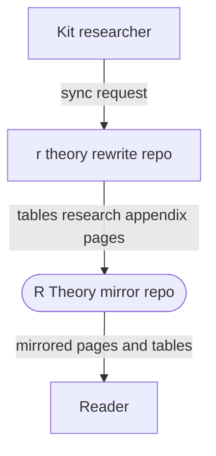
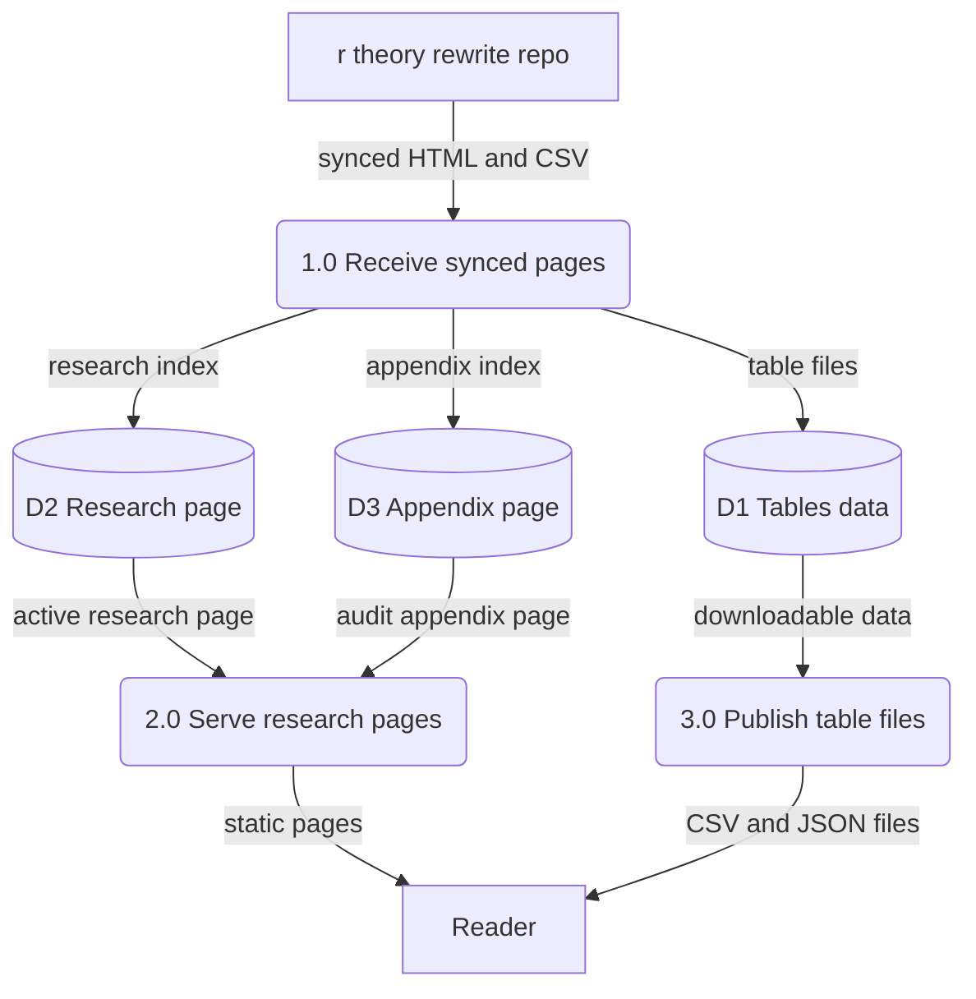
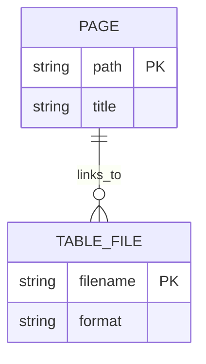

Living document — update these diagrams when adding features.
# r-theory — Architecture

Relationship to r-theory-rewrite: r-theory-rewrite is the SOURCE repo — the full rewrite series with all books, audit scripts, and build tooling. R-Theory is a derived BACKUP MIRROR containing only three page groups synced from r-theory-rewrite: tables, research, and appendix. The repo's own GitHub description says: backup mirror of the R Theory rewrite site research pages, synced from r-theory-rewrite. It has no README (the readme API call 404s) and no build tooling — it exists to preserve a readable copy of the research pages independent of the main series repo.

Observed contents (recursive tree listing, 13 paths total): LICENSE, appendix/index.html, research/index.html, tables/index.html, plus six tables data files (Me_reference_diag.csv, Me_reference_params.json, P54_135_diag.csv, Pi0_grade_diag.csv, Pi2_grade_diag.csv, Pi_rest_grade_diag.csv). Page titles observed from the HTML: "R Theory — Active Research", "Computational Audit Appendix — R Theory Rewrite Series", "Pre-computed Tables — R Theory Rewrite Series".

## 1. Context diagram (level 0)

## 2. Level-1 data flow diagram

Process grounding: 1.0 is grounded on the repo description "synced from r-theory-rewrite" (the sync mechanism itself is INFERRED — no sync script was observed in this repo). 2.0 and 3.0 reflect the static HTML pages and CSV/JSON data files actually present in the tree.

## 3. Entity–relationship diagram

No persistent data model observed — this is a static mirror with no code, no database, no forms. Minimal honest ERD of what the repo holds:

Observed: three pages (appendix/index.html, research/index.html, tables/index.html) and six data files (five CSV, one JSON) under tables/. The tables/index.html links to the data files; the appendix page documents the computational audit; the research page is titled Active Research.

## Grounding notes
- OBSERVED: repo metadata — description "Backup mirror of the R Theory rewrite site research pages (tables, research, appendix), synced from r-theory-rewrite", default branch main, language HTML, no homepage.
- OBSERVED: readme API call returned 404 — the repo has no README.
- OBSERVED: full recursive tree listing — 10 blobs, no directories beyond appendix, research, tables; file names and sizes listed above.
- OBSERVED: <title> tags and first bytes of research/index.html, appendix/index.html, tables/index.html fetched via the contents API.
- INFERRED: the sync process that copies pages from r-theory-rewrite (asserted by the repo description; no sync script, webhook, or cron observed in this repo).
- INFERRED: how readers reach the pages (GitHub Pages serving was not observed; no CNAME or workflows exist in the tree).
